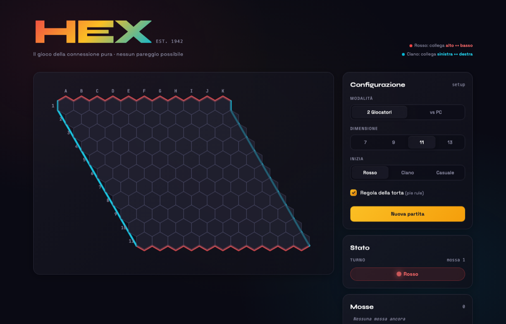

# HEX

[](https://lucanenni.github.io/hex-game/)
[](LICENSE)

Il classico gioco da tavolo di connessione, giocabile nel browser. Nessuna build, nessuna dipendenza da installare: HTML, CSS e JavaScript puri.

**[▶ Gioca ora](https://lucanenni.github.io/hex-game/)**



## Come si gioca

Due giocatori si alternano piazzando pedine su una griglia esagonale:

- **Rosso** deve collegare il bordo **superiore** a quello **inferiore**.
- **Ciano** deve collegare il bordo **sinistro** a quello **destro**.

Non esistono pareggi: la partita finisce non appena uno dei due completa la propria connessione. È disponibile la **regola della torta** (pie rule), che bilancia il vantaggio della prima mossa lasciando al secondo giocatore la possibilità di scambiare colore dopo la prima mossa dell'avversario.

Modalità disponibili:
- **2 Giocatori**, sullo stesso schermo.
- **Vs PC**, con tre livelli di difficoltà (facile, medio, difficile — l'IA usa una valutazione basata sulla distanza minima tra i bordi, tipo Dijkstra, con ricerca minimax a profondità limitata nel livello difficile).

Dimensioni di griglia selezionabili: 7×7, 9×9, 11×11, 13×13.

## Eseguire il gioco in locale

Basta aprire [`index.html`](index.html) nel browser, oppure servire la cartella con un qualsiasi server statico, ad esempio:

```bash
python3 -m http.server 8000
```

e visitare `http://localhost:8000`.

## Struttura del progetto

```
index.html        struttura della pagina
css/style.css      stili dell'interfaccia
js/hexGame.js       modello del gioco: board, mosse, pie rule, rilevamento vittoria
js/ai.js            intelligenza artificiale: valutazione a distanza minima, greedy, minimax
js/app.js           rendering SVG della board e orchestrazione dell'interfaccia
```

## Nota tecnica

Il layout usa il CDN "Play" di Tailwind CSS (`cdn.tailwindcss.com`), pensato per prototipazione: comodo per un progetto a file singolo senza build step, ma sconsigliato per produzione su larga scala (genera il CSS a runtime nel browser). Per un uso più che dimostrativo conviene compilare Tailwind via CLI o PostCSS.

## Storia

Hex fu inventato indipendentemente da **Piet Hein** (1942) e **John Nash** (1948).

## Licenza

Distribuito con licenza [MIT](LICENSE).
